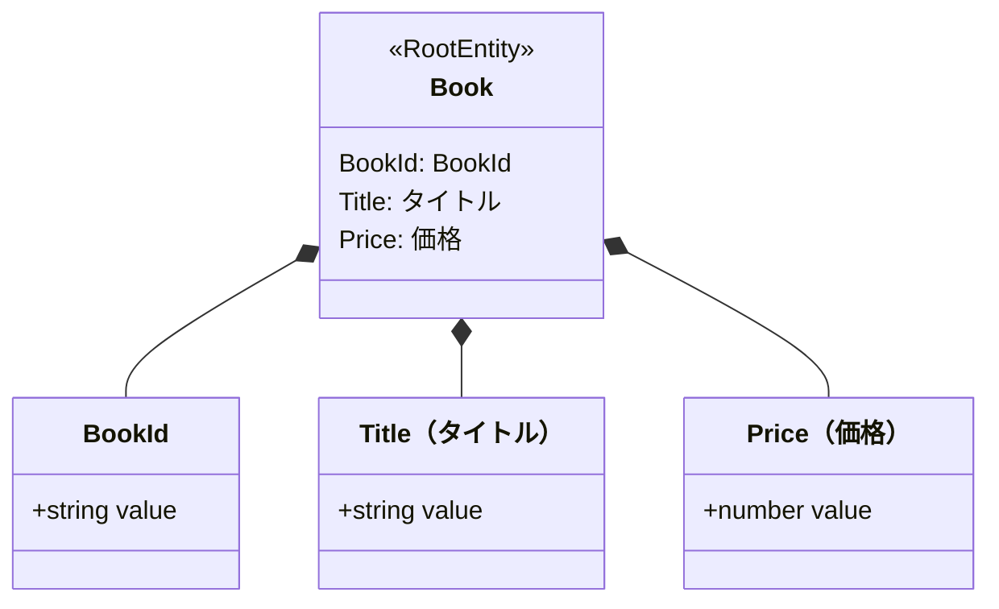

```mermaid
classDiagram
    class Book {
        <<RootEntity>>
        BookId: BookId
        Title: タイトル
        Price: 価格
    }
    class BookId ["BookId"] {
      +string value
    }
    class Title ["Title（タイトル）"] {
      +string value
    }
    class Price ["Price（価格）"] {
      +number value
    }
    Book *-- BookId
    Book *-- Title
    Book *-- Price
```