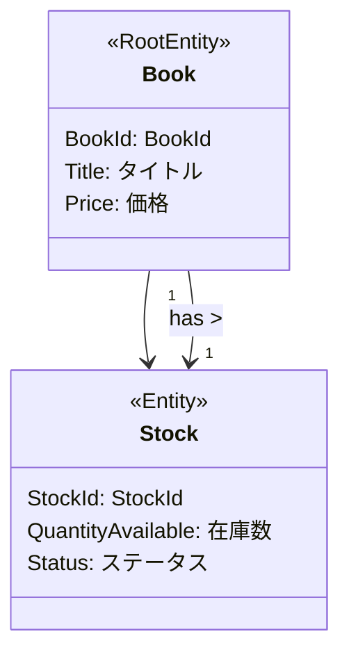

```mermaid
classDiagram
    %% 書籍集約 (Book Aggregation)

    %% 1. エンティティの定義
    class Book {
        <<RootEntity>>
        BookId: BookId
        Title: タイトル
        Price: 価格
    }

    class Stock {
        <<Entity>>
        StockId: StockId
        QuantityAvailable: 在庫数
        Status: ステータス
    }

    Book --> Stock
    Book "1" --> "1" Stock : has >
```
