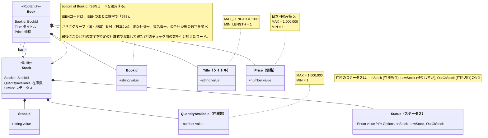

```mermaid
classDiagram
    %% 書籍集約 (Book Aggregation)

    %% 1. エンティティの定義
    class Book {
        <<RootEntity>>
        BookId: BookId
        Title: タイトル
        Price: 価格
    }

    class Stock {
        <<Entity>>
        StockId: StockId
        QuantityAvailable: 在庫数
        Status: ステータス
    }

    Book --> Stock

    %% 2. 属性の定義
    class BookId ["BookId"] {
      +string value
    }
    class Title ["Title（タイトル）"] {
      +string value
    }
    class Price ["Price（価格）"] {
      +number value
    }
    class Status ["Status（ステータス）"] {
      +Enum value %% Options: InStock, LowStock, OutOfStock
    }
    class StockId ["StockId"] {
      +string value
    }
    class QuantityAvailable ["QuantityAvailable（在庫数）"] {
      +number value
    }

    %% 3. ルールの追加
    note for BookId "bottom of BookId: ISBNコードを適用する。
        <br>ISBNコードは、ISBNのあとに数字で「978」、
        <br>さらにグループ（国・地域）番号（日本は4）、出版社番号、書名番号、の合計12桁の数字を並べ、
        <br>最後にこの12桁の数字を特定の計算式で演算して得た1桁のチェック用の数を付け加えたコード。"

    note for Title "MAX_LENGTH = 1000<br>MIN_LENGTH = 1"
    note for QuantityAvailable "MAX = 1,000,000<br>MIN = 1"
    note for Price "日本円のみ扱う。<br>MAX = 1,000,000<br>MIN = 1"
    note for Status "在庫のステータスは、 InStock (在庫あり), LowStock (残りわずか), OutOfStock (在庫切れ)の3つ"

    %% 4. 関係性の定義
    Book "1" --> "1" Stock : has >
    
    Book *-- BookId
    Book *-- Title
    Book *-- Price
    
    Stock *-- StockId
    Stock *-- QuantityAvailable
    Stock *-- Status
```