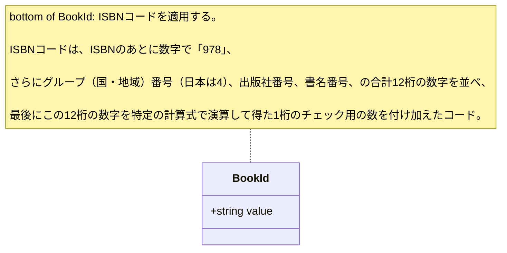

```mermaid
classDiagram
    class BookId ["BookId"] {
      +string value
    }

    note for BookId "bottom of BookId: ISBNコードを適用する。
        <br>ISBNコードは、ISBNのあとに数字で「978」、
        <br>さらにグループ（国・地域）番号（日本は4）、出版社番号、書名番号、の合計12桁の数字を並べ、
        <br>最後にこの12桁の数字を特定の計算式で演算して得た1桁のチェック用の数を付け加えたコード。"
```