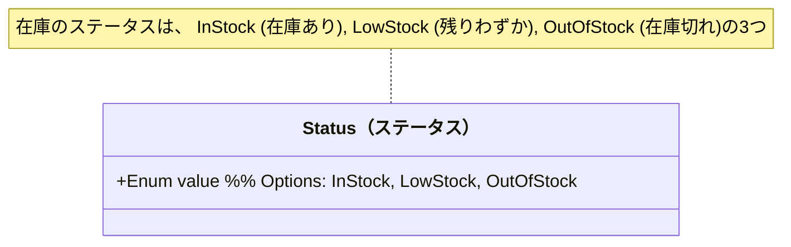

```mermaid
classDiagram
    class Status ["Status（ステータス）"] {
      +Enum value %% Options: InStock, LowStock, OutOfStock
    }
    note for Status "在庫のステータスは、 InStock (在庫あり), LowStock (残りわずか), OutOfStock (在庫切れ)の3つ"
```