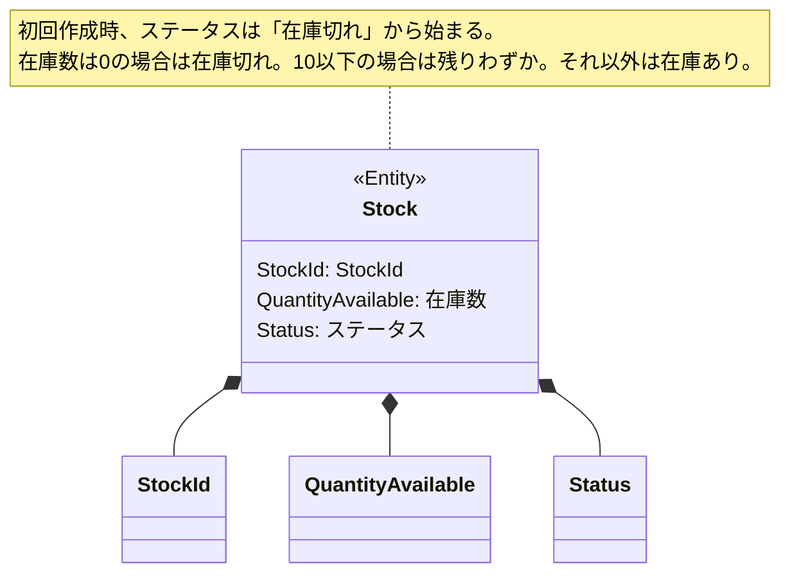

```mermaid
classDiagram
    class Stock {
        <<Entity>>
        StockId: StockId
        QuantityAvailable: 在庫数
        Status: ステータス
    }

    
    Stock *-- StockId
    Stock *-- QuantityAvailable
    Stock *-- Status

    note for Stock "初回作成時、ステータスは「在庫切れ」から始まる。<br>在庫数は0の場合は在庫切れ。10以下の場合は残りわずか。それ以外は在庫あり。"
```